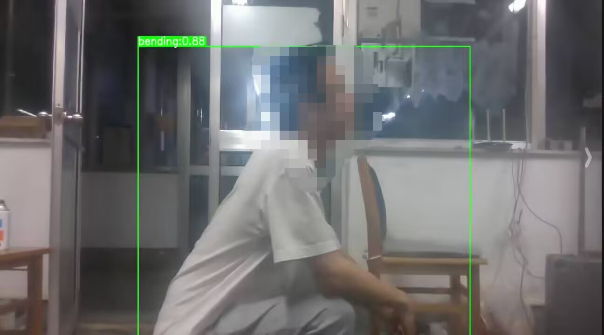

<a name="OqRAe"></a>
#### 1.项目描述
船上搭载摄像头和板载电脑，使用yolo5实现人体三种姿态检测（up，bending，down），板载电脑通过无线wifi与PC端建成局域网，将识别结果视频流，通过ffmpeg推流至PC端，并通过Qt5(C++)上位机展显示。



#### 2.安装pytorch指定环境
请参考官网
```bash
#安装pytorch指定环境
pip install pytorch==2.2.2 torchvision==0.17.2
```

<a name="gdY5O"></a>
#### 3.创建管理子进程，使用FFmpeg将识别结果推流到rtsp服务器
[【python】使用ffmpeg+opencv读取摄像头并推流到rtmp服务器 - 代码诠释的世界 - 博客园](https://www.cnblogs.com/fireblackman/p/16619884.html)

<a name="y8XIR"></a>
#### 4.固定摄像头端口号
```bash
#固定摄像头端口号
ls -l /sys/class/video4linux/
cd  /sys/devices/70090000.xusb/usb1/1-3/1-3:1.0/video4linux/video0
cat name

cd /etc/udev/rules.d
sudo vim 99-nv-l4t-usb-host-config.rules
SUBSYSTEM=="video*", ATTRS{name} =="Full HD webcam", ATTR{index}=="0", MODE="0777",SYMLINK+="cam0"
sudo udevadm trigger
```

[【linux】linux下摄像头设置固定的设备名-udev_linux 摄像头的设备文件名-CSDN博客](https://blog.csdn.net/qq_37280428/article/details/124960303)

[ubuntu18.04固定摄像头标志为video0_99-nv-l4t-usb-host-config.rules-CSDN博客](https://blog.csdn.net/weixin_44391770/article/details/122712894#:~:text=ubuntu18.04%E5%9B%BA%E5%AE%9A%E6%91%84%E5%83%8F%E5%A4%B4%E6%A0%87%E5%BF%97%E4%B8%BAvideo0%201%201%E3%80%81%E6%9F%A5%E7%9C%8Bvideo%E8%AE%BE%E5%A4%87%E5%AF%B9%E5%BA%94%E7%9A%84%E6%96%87%E4%BB%B6%E5%A4%B9%E4%BD%8D%E7%BD%AE%20root%40root%3A~%23%20ls%20-l%20%20%2F,6%E3%80%81%E8%BF%9B%E5%85%A5%2Fetc%2Fudev%2Frules.d%2F%E6%96%87%E4%BB%B6%E5%A4%B9%E4%B8%8B%EF%BC%8C%E7%BC%96%E8%BE%9199-nv-l4t-usb-host-config.rules%E6%96%87%E4%BB%B6%20...%207%207%E3%80%81%E6%89%A7%E8%A1%8C%E4%BB%A5%E4%B8%8B%E5%91%BD%E4%BB%A4%EF%BC%8C%E4%BD%BFudev%E8%A7%84%E5%88%99%E7%94%9F%E6%95%88%20...%208%208%E3%80%81%E6%AD%A4%E6%97%B6%E5%B0%9D%E8%AF%95%E5%A4%9A%E6%AC%A1%E6%8F%92%E6%8B%94%E6%91%84%E5%83%8F%E5%A4%B4%EF%BC%8C%E6%91%84%E5%83%8F%E5%A4%B4%E4%BC%9A%E5%8F%98%E6%88%90video1%EF%BC%8C%E4%BD%86%E5%90%8C%E6%97%B6%E4%BC%9A%E7%94%9F%E6%88%90%E4%B8%80%E4%B8%AAvideo0%20)
